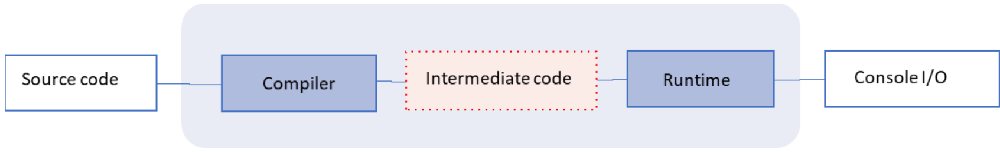
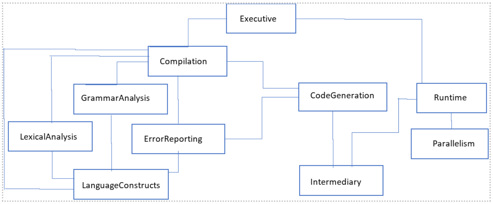

# Sachin: A parallel programming language and its portable compiler and runtime
In here, you can find the definition of a new computer programming language that supports procedural and parallel programming, and a fully functional compiler and runtime for it. I have developed the language,  the compiler, and the runtime on my own. The purpose of the language is educational. I hope it works as a tool for exploring parallel programming algorithms, and would like any interested student or professional to benefit from it. I am releasing the source code under MIT license.

My interest in compiler construction and parallel programming were kindled by my professor, the renowned computer scientist Dr. Per Brinch Hansen. I wondered what would it look like to have a language that supported parallel programming instrinsically. The result is this project.

*Fun fact*: I have named the language after my most favorite cricketer, Sachin Tendulkar!

## Language features
Some of the highlights of this language are:
- **Portable compiler**. The compiler produces intermediate code. By writing a simple target-specific interpreter, the intermediate code can be made to run on any new platform.
- **Strong type checking**. Types may not be mixed. Booleans cannot be assigned to Integers, or vice versa. Same goes for the Channel type. *if* and *while* loop expressions must evaluate to a Boolean. C and C++ do not support this instrinically where you could pass an integer expression into a if/while loop. That is semantically poor.
- **Multiple assignment**. You could do *a, b = c, 4 + 5;*. That is assigning multiple variables in a single statement. This is elegant. And it helps do away with a temporary variable for swapping operations - you can do *a , b = b, a;*.
- **Pass by reference**. Functions can take parameters by value or by reference. The language also enforces that the keyword *reference* is used at the function's caller end as well, so that it is clear to the reader whether the parameter is by reference or by value. This is enforcing strong semantics and clarity. Contrast this with C++ where a function call can look like *Test(a);*. But the reader cannot tell without diving into the function signature whether the parameter *a* is *pass by reference* or *pass by value*. In this language, the call would look like *Test(reference a);*.
- **Bound checking on array access**. Array access is bound-checked at runtime so that unintended memory is not accessed. This is not supported by even advanced languages like C and C++.
- **Supports recursive functions**. Function recursion adds elegance, and is supported in this language. Many high level languages like the traditional Fortran dont support it, which can be pretty restrictive.
- **In-built parallel constructs**. This language supports parallel programming instrinsically. Programmers can think of and implement parallel programs elegantly and securely without trying to build contrived skeletons and frameworks to support them.
- **Supports parallel recursion**. Some of the most challenging problems can be solved elegantly using parallel recursion - functions running in parallel, and recursively, such as *parallel merge sort*.
- **Elegant single pass compilation**. The compiler needs only a single pass of the source code to produce the intermediate portable code. Compare this with many high level languages which require multiple passes of the source code to resolve labels and references. We use many elegant algorithms in this project such as *single symbol look ahead* for scanning, and *recursive descent with error recovery* for parsing.

## Language constructs
Let us learn the language constructs through examples.
### Basics
Comments are single-line - marked by $, followed by the comment itself, and delimited by the end of the line.
```
$ This is a sample comment.
integer x = 5; $ We can add a comment to the end of a statement too.
```

Each statement is delimited by a semicolon.
```
integer 5;
read a;
```

Types, Constants, Arrays: Boolean and Integer are the two primitive types that are supported. [Channel is another primitive type that is supported but we will look at it when we get to parallel programming later on.] Constants and arrays are also supported. Please note that arrays are 1-based (elements start from 1). That is semantically more accurate than 0-based counting in most other languages.
```
integer total;
boolean found;
constant enable = true; $ The type of a constant is determined automatically.
constant max = 100;     $ The type of a constant is determined automatically.
integer[max] numbers;   $ where max is a constant integer.
boolean[10] signals;
```

I/O: read and write are the keywords for reading from and writing to the console respectively.
```
read a, b;
write c, 4 + 5, signal;
```

Conditional and Looping clauses: The language supports if/else and while statements.
```
if (b == 0)
{
  result = a;
}
else
{
  result = GreatestCommonDivisor(b, a % b);
}
```

```
while (count <= max)
{
  write count;
  count = count + 1;
}
```

### Functions
Functions are defined by an "@" followed by the signature and the implemention. They can optionally define a return value. They can also optionally take in parameters. The parameters can be reference types or value types.
 ```
$ A function that returns void.
@ PrintSum(integer a, integer b)
{
  $ Logic to add the two numbers and print the output.
}
```

 ```
$ A function that returns a value. When the function ends, the value of the variable result will be returned to the caller.
@ [integer result] Factorial (integer number)
{
  $ Logic ...
}
```

```
$A function that takes a parameter by reference.
@ Factorial(reference integer number)
{
  $ Logic ...
}
```

### Parallel programming constructs
The keyword *parallel* followed by a function call will make the function run in parallel.
```
$ This call will invoke the execution of the function Add in a parallel node.
parallel Add(link, 3, 4);
```
For connecting the parallel nodes, the language provides a *channel*. A channel can be used to send or to receive an integer value. Two nodes can be connected through a channel, and they can send and receive data through it. Note that a channel must be opened before use.
```
$ Program to demonstrate parallel constructs in the language.
$ Here, we are kicking off a node to run in parallel that will execute the sum of adding two numbers, and would send the result back to the main node.
{
  @ Add(channel link, integer a, integer b)
  {
    send (a + b) -> link;
  }

  channel link;
  integer sum;

  open link;
  parallel Add(link, 3, 4);
  receive sum -> link;
  write sum;
}
```

See appendix for the full definition of the language.

## Sample programs
In the folder named Samples, you will see some programs that should help you familiarize with the language. Here is a quick summary of the various programs.

### Sequential programs
- **Prime.txt**: Program to determine whether a given number is prime or not. Demonstrates the basics of the language like read/write statements, if/else clauses, while loop etc.
- **ReverseNumber.txt**: Program to reverse the digits of a number. Demonstrates the basics of the language like read/write statements, if/else clauses, while loop etc.
- **EuclideanGCD.txt**: Program to find the greatest common divisor of two given numbers. Demonstrates recursive functions.
- **SelectionSort.txt**: Program to sort an array of numbers using the Selection Sort algorithm. Demonstrates the usage of arrays and parallel assignment.
- **QuickSort.txt**: Program to sort an array of numbers using the Quick Sort algorithm. Demonstrates the usage of arrays and recursive functions.
- **Factorial-ByValue.txt**: Program to find the factorial of a given number. Demonstrates recursive functions and parameter passing by value.
- **Factorial-ByReference.txt**: Program to find the factorial of a given number. Demonstrates recursive functions and parameter passing by reference.

### Parallel programs
- **Parallel-MillerRabin.txt**: Parallel program to find the primality of a number using Miller-Rabin algorithm. Miller-Rabin algorithm is a probabilistic test for the primality of a number. This program connects parallel nodes in a ***pipeline configuration***, and runs the Miller-Rabin algorithm on each node. If any one of the trials shows that a number is composite, then this is the correct answer. However, if all trials fail to prove that a number is composite, then it is almost certainly prime. Also, contrast this parallel program with **MillerRabin.txt** which is a sequential program for the Miller-Rabin algorithm.
- **Parallel-AddDigits.txt**: Parallel program to find the sum of the squares of the digits in a number. Demonstrates ***parallel recursion***.

## Running the project
This project includes the compiler and the runtime for the parallel programming language discussed above, and is implemented in C# with Visual Studio Community 2022.

To run it:
- Download and build the Visual Studio Solution shared in this repository.
- In a command prompt, navigate to the bin directory under the project named *Executive*.
- Run: **Sachin.exe execute *path-to-your-source-code-file***.

## Design of the compiler and the runtime
So far, we discussed a new parallel programming language alright. But how are the compiler and the runtime implemented? As mentioned above, the compiler and runtime are implemented in C#.

Now, Let us look at the design of the various components for the compiler and the runtime.

### Context diagram

- The compiler is fed with the input code file. The compiler component validates the code for correctness. If the code passes the validation, the compiler produces a file with the intermediate code.
- The intermediate code file is then fed into the runtime which interprets and executes the intermediate code.


### Module layout

A compiler fits nicely into a waterfall model of systematic development. The code development can be split into various phases. The modules as shown in the diagram can be built bottom-up. Here are the various modules in the compiler. Each module contains three or four types (enums, structs, classes) which add up to provide the whole functionality for the module. The code is well commented, so any programmer should be able to read through and understand it with reasonably small effort.

- **LanguageConstructs**: Defines the fundamental constructs of the programming language.
- **LexicalAnalysis**: Performs lexical analysis by scanning the input code file for tokens.
- **ErrorReporting**: Defines the various types of compilation errors, and provides functionality to print them out.
- **GrammarAnalysis**: Provides functionality to maintain metadata, object records, and the scope levels of the varaibles, parameters and procedures during compilation.
- **Intermediary**: Defines all the opcodes supported in the intermediate language.
- **CodeGeneration**: Provides methods to generate the intermediate code.
- **Compilation**: Utilizes the lexical analysis, grammar analysis, and code generation libraries to perform compilation.
- **Parallelism**: Provides runtime support for parallel execution of code.
- **Runtime**: Provides methods to interpret and execute the intermediate code, in parallel when required.
- **Executive**: The executive class for this project which gets the user input, and calls into the relevant modules (compilation, runtime etc.) as appropriate.

## Appendix
### Backus-Naur form
Here is the complete BNF for the language.
```
Program = Block

Block = "{" DefinitionPart StatementPart "}" 

DefinitionPart = { ProcedureDefinition | ConstantDefinition ";" | VariableDefinition ";" } 

StatementPart = { IfStatement | WhileStatement | Statement ";" }

Definition = ConstantDefinition | VariableDefinition | ProcedureDefinition

ConstantDefinition = "constant" ConstantName "=" [ "-" ] Constant

Constant = Numeral | BooleanSymbol | ConstantName

VariableDefinition = TypeSymbol VariableList | TypeSymbol ArrayDeclaration

ProcedureDefinition = "@" [ "[" TypeSymbol Name "]" ] Name "("  [ ParameterDefinition ] ")" Block

ParameterDefinition = ["reference"] TypeSymbol Name { "," ["reference"] TypeSymbol Name }

TypeSymbol = "integer" | "boolean" | "channel"

ArrayDeclaration = "[" Constant "]" VariableList 

VariableList = VariableName { "," VariableName } 

ObjectAccessList = ObjectAccess { "," ObjectAccess }

ObjectAccess = ObjectName [ IndexedSelector ]

IndexedSelector = "[" Expression "]" 

BooleanSymbol = "false" | "true" 

Statement = ReadStatement | WriteStatement | AssignmentStatement | IfStatement | WhileStatement | ProcedureInvocation | RandomizeStatement | OpenStatement | SendStatement | ReceiveStatement | ParallelStatement

ReadStatement = "read" ObjectAccessList

WriteStatement = "write" ExpressionList 

OpenStatement = "open" ObjectAccessList

RandomizeStatement = "random" ObjectAccessList

SendStatement = "send" Expression "->" Expression

ReceiveStatement = "receive" ObjectAccess "->" Expression

ParallelStatement = "parallel" ProcedureInvocation

AssignmentStatement = ObjectAccess [, ObjectAccess] "=" Expression [, Expression]

IfStatement = "if" "(" Expression ")" Block [ "else" Block ]

WhileStatement = "while" "(" Expression ")" Block

AddingOperator = "+" | "-"

RelationalOperator = "<" | "<=" | "==" | "!=" | ">" | ">=" 

PrimaryOperator = "&" | "|"

MultiplyingOperator = "*" | "/" | "%" | "^" 

ProcedureInvocation = Name "(" { Expression | "reference" ObjectAccess } ")"

ExpressionList = Expression { "," Expression } 

Expression = PrimaryExpression { PrimaryOperator PrimaryExpression } 

PrimaryExpression = SimpleExpression [ RelationalOperator SimpleExpression ]

SimpleExpression = [ "-" ] Term { AddingOperator Term } 

Term = Factor { MultiplyingOperator Factor } 

Factor = Constant | ObjectAccess | "(" Expression ")" | "!" Factor 
```